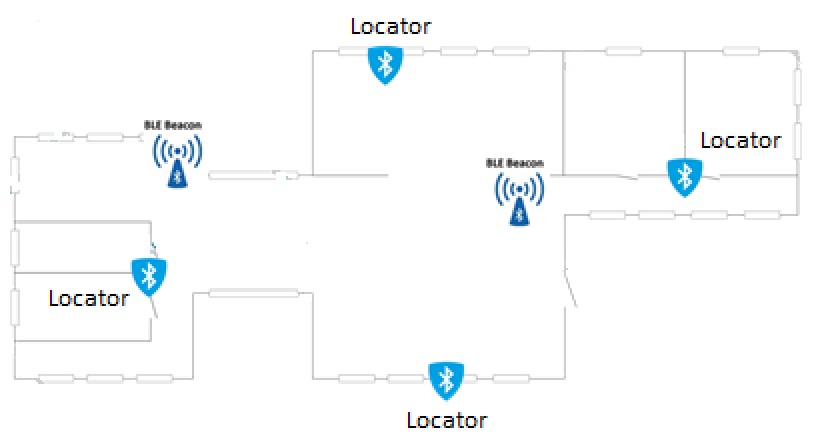

# Introduction

Asset management through indoor positioning via bluetooth. 

 - Solution: FIND ([github.com/schollz/find](https://github.com/schollz/find))
 - Locator: ESP32 for gathering fingerprints actively or passively 
 - Beacon: nRF52832 for emitting bluetooth signal and representing assets 

# Technology


## FIND

([Installation](https://www.internalpositioning.com/doc/server_setup.md))

([API](https://www.internalpositioning.com/doc/api.md)) 

 - Get a list of all devices  
   ` python3 -m pip install httpie  `  
   ` HTTP GET https://thefindserver/api/v1/devices/FAMILY `
 - Get the last known location for a device  
   ` HTTP GET https://thefindserver/api/v1/location/FAMILY/DEVICE `


### HTTPS using caddy

 - Create ssl key and certification for caddy and http client both  
     `openssl req -new -x509 -nodes -newkey rsa:4096 -keyout client.key -out client.crt`  

 - Create Caddyfile  
    ```
    https://192.168.31.131 {  
            tls /apathto/client.crt /apathto/client.key  
            proxy / 127.0.0.1:8005 {  
                    transparent  
                    websocket  
            }  
    }
    ```     

 - Run caddy  
     ` caddy -conf /var/local/caddy/Caddyfile`  


## Locator

ESP32 WROOM development board (brough from taobao)
### installation
 - arduino IDE 
 - arduino-esp32 ([https://github.com/espressif/arduino-esp32](https://github.com/espressif/arduino-esp32))
 - arduino project file [sketch](/sketch_oct13b.ino)
 (size issue, choose  WROOM board )
 
### usage
 - Active scan: gather fingerprints for the specific location after adaptation code and burning into ESP32  
    ```
        POST /data
        {  
        "d":"DEVICE",
        "f":"FAMILY",
        "t":1520424248897,
        "l":"LOCATION",
        "s":{  
            "bluetooth":{  
                "20:25:64:b7:91:42":-72,
                "20:25:64:b8:06:38":-81,    
                }
            }
        }  
    ```  
 - Passive scan: gather fingerprints for beacons after adaptation code and burning into ESP32  
    ```
        POST /passive
        {  
        "d":"DEVICE",
        "f":"FAMILY",
        "t":1520424248897,
        "s":{  
            "bluetooth":{  
                "20:25:64:b7:91:42":-72,
                "20:25:64:b8:06:38":-81,    
                }
            }
        }
    ```  
    Customize passive scanning for specific beacons in any PC    
        learning:  
            ` http POST https://thefindserver/api/v1/settings/passive family=FAMILY device=bluetooth-60:57:18:3d:b8:14 location="living room" `  
        stop learning:  
            ` http POST https://thefindserver/api/v1/settings/passive family=FAMILY device=bluetooth-60:57:18:3d:b8:14 `  


## Beacon

- Development with ([nRF5 Series: Developing with SEGGER Embedded Studio](https://infocenter.nordicsemi.com/topic/ug_gsg_ses/UG/gsg/install_toolchain.html))  

- Specific Board nrf52832_tb with one button, one LED (brought from taobao, 30RMB) but available with jlink interface  

    board file [nrf52832_tb](./nRF5_SDK_xxx/components/boards/nrf52832_tb.h)  
    example project with this board [ble_app_eddystone](./nRF5_SDK_xxx/examples/ble_peripheral/ble_app_eddystone/nrf52832_tb/s132/ses/ble_app_eddystone_nrf52832_tb_s132.emProject)

- Major and Minor field are used for asset managmement  

